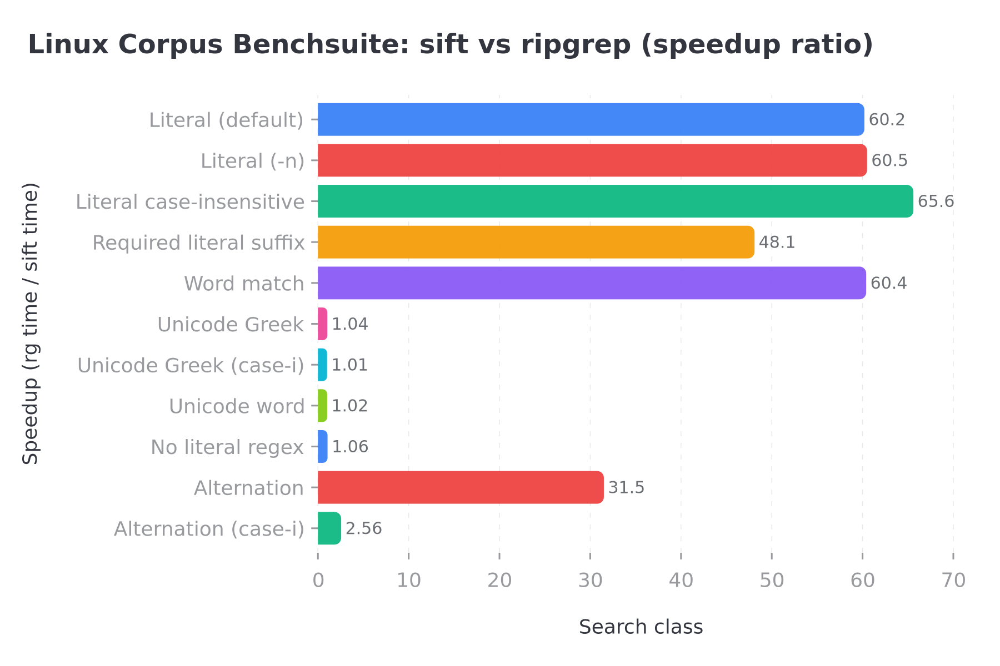

# sift

**Indexed** regex search over a codebase: build a trigram index once, then query it with a grep-like CLI or the **`sift-core`** library.

| Crate | Package | Purpose |
|-------|---------|---------|
| `crates/core` | `sift-core` | Index + `CompiledSearch` + `search_index` / `search_walk` |
| `crates/cli` | `sift-cli` | `sift` binary (ripgrep-shaped flags) |
| `fuzz/` | (standalone) | `cargo-fuzz` against `sift-core` only |

**Docs:** [`crates/core/benches/README.md`](crates/core/benches/README.md) (benchmarks & profiling), [`plan.md`](plan.md) (roadmap), [`AGENTS.md`](AGENTS.md) (repo / automation hints). Per-crate **`README.md`** and **`AGENTS.md`** live under each crate and under `fuzz/`.

**Agent skills** ([skills.sh](https://skills.sh) / `npx skills`): [`skills/README.md`](skills/README.md).

**Manual `rg` vs `sift` timing demo** (kernel tree, no scripts — you run both and compare): [`demo/kernel-video/README.md`](demo/kernel-video/README.md).

## Quick start

### Install binary (GitHub Release)

```bash
curl -fsSL https://raw.githubusercontent.com/botirk38/sift/v0.1.2/scripts/install.sh | sh
```

Installs to **`$HOME/.local/bin/sift`** by default (override with `PREFIX`).

Environment variables:

| Variable | Meaning |
|----------|---------|
| `SIFT_REPO` | `owner/repo` on GitHub (default: **`botirk38/sift`**) |
| `SIFT_VERSION` | Release without `v`, e.g. `0.1.2` (skips GitHub API if set) |
| `SIFT_DEFAULT_VERSION` | Fallback if the API is rate-limited (default baked into the script) |
| `PREFIX` | Install prefix; binary at `$PREFIX/bin` |

If **`curl https://api.github.com/.../releases/latest` hits a rate limit**, either export `SIFT_VERSION=0.1.2` before running the script or rely on the script’s built-in default version.

### From source

```bash
cargo build --release -p sift-cli
./target/release/sift --sift-dir .sift build /path/to/corpus
./target/release/sift --sift-dir .sift pattern
```

Patterns use Rust’s **`regex`** syntax unless **`-F`** (fixed string). Literal **`build`**: `sift -- build` or `-e build`.

## CLI vs ripgrep (short)

- Search needs a **prior index** (`build`).
- Optional path arguments must lie **under** the indexed corpus root.
- No glob `-g` here yet; **`--no-filename`** is used instead of **`-h`** (help).

## Performance snapshot

Current Linux benchsuite snapshot against the Linux corpus.

- correctness parity: **11/11**
- `sift` faster: **11/11**
- `rg` faster: **0/11**



| Search class | Snapshot | Takeaway |
|---|---:|---|
| Indexed literals | `~60x` faster | Trigram narrowing is doing the heavy lifting |
| Indexed word matches | `~60x` faster | Whole-word literal shaping stays cheap |
| Indexed alternation | `~31x` faster | Candidate narrowing plus `build_many` helps a lot |
| Full-scan Unicode | `~1.0x` | Near parity overall, Greek classes now competitive |
| Full-scan no-literal regex | `~1.1x` | Regex-engine full scans now comparable to `rg` |

Fast path takeaways:

- indexed literal, word, suffix-literal, and alternation searches are decisively faster with `sift`
- full-scan Unicode class searches are the main remaining gap versus `rg`
- see [`crates/core/benches/README.md`](crates/core/benches/README.md) for the benchmark and profiling workflow

## Develop

```bash
cargo test --workspace --all-features
cargo clippy-check   # see `.cargo/config.toml`
```

CI (GitHub Actions): **`fmt`**, **`clippy`** with **`-D warnings`**, **`test`** on **Linux, macOS, and Windows** for pushes/PRs to `main` / `master` — [`.github/workflows/ci.yml`](.github/workflows/ci.yml).
