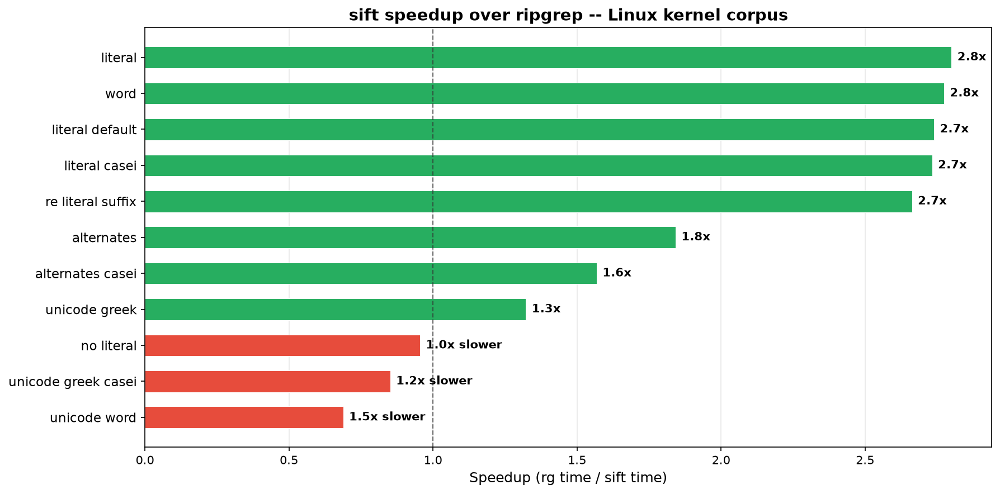
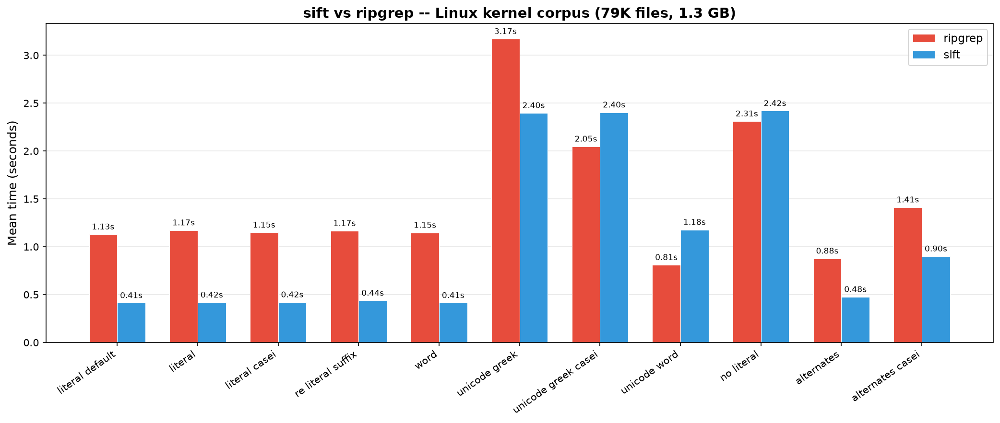

# Sift

Indexed grep for codebases. Build a trigram index once, then search **2--3x faster** than ripgrep on literal queries.

```bash
sift index build .          # one-time index
sift "PM_RESUME"            # instant results
```

## Install

```bash
curl -fsSL https://raw.githubusercontent.com/botirk38/sift/master/scripts/install.sh | sh
```

Or from source: `cargo build --release -p sift-grep`

## How It Works

1. **Build** -- extract overlapping 3-byte trigrams from every file, persist as memory-mapped tables.
2. **Plan** -- decompose the regex into trigram terms, intersect posting lists to produce a candidate set.
3. **Search** -- scan only candidate files with the full regex engine.

Queries with index hits skip most of the corpus. Full-scan fallback (e.g. `\p{Greek}`) matches ripgrep performance.

## Performance

Linux kernel source tree -- 79K files, 1.3 GB. End-to-end CLI wall-clock (includes startup, index open, daemon).





| Query type | `rg` | `sift` | Speedup |
|---|---:|---:|---:|
| Literal | 1.17s | 0.42s | **2.8x** |
| Word match | 1.15s | 0.41s | **2.8x** |
| Regex with literal | 1.17s | 0.44s | **2.7x** |
| Alternation | 0.88s | 0.48s | **1.8x** |
| Unicode (full scan) | 2.05s | 2.40s | 0.9x |
| No-literal (full scan) | 2.31s | 2.42s | 1.0x |

**11/11** benchmarks produce identical line counts. See [`benchsuite/`](benchsuite/).

> The search engine itself runs in ~18 ms for indexed literals (`--stats`). Wall-clock is dominated by process startup and daemon coordination.

## Architecture

Sift is built around **composable on-disk indexes**. The `Indexes` registry opens all index kinds under a `.sift` directory and intersects their candidate sets at query time.

```
  pattern --> Planner --> [Trigram] [Future Index B] [Future Index C]
                              \           |            /
                               intersect / union
                                      |
                              candidate set --> regex scan
```

Today there is one index kind (`Trigram`). Adding a new kind means adding a variant to `IndexKind` / `Index` and implementing the build/open/update lifecycle. The planner, search engine, and CLI work unchanged.

## Project Layout

| Path | Role |
|------|------|
| `crates/core/` | Index registry, query planner, search engine |
| `crates/cli/` | `sift` binary (ripgrep-compatible flags) |
| `benchsuite/` | Comparative rg vs sift benchmarks + chart generation |
| `fuzz/` | Cargo-fuzz targets |

## Differences from ripgrep

- Requires `sift index build` before searching (async via daemon by default, `--wait` for blocking).
- Search paths must sit under the indexed corpus root.
- `SIFT_NO_DAEMON=1` disables background indexing.

See [`docs/rg-compat-matrix.md`](docs/rg-compat-matrix.md) for the full flag matrix.

## Development

```bash
cargo fmt --all -- --check
cargo clippy --workspace --all-targets --all-features -- -D warnings
cargo test --workspace --all-features
```

## License

Dual-licensed under [MIT](LICENSE-MIT) or [Apache-2.0](LICENSE-APACHE-2.0), at your option.
